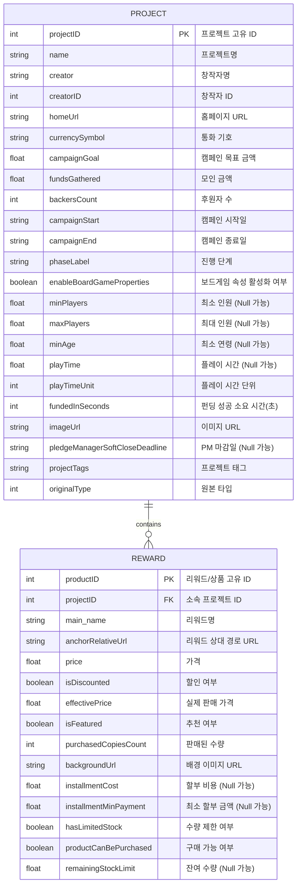

# Asac-ML-project

## 📊 데이터베이스 구조 (ERD)

## 📂프로젝트 폴더 구조 (ERD)
```text
Asac-ML-project/
│
├── src/                    # 실제 실행 가능한 소스 코드
│   ├── data_loader.py      # 데이터 로드 및 수집 스크립트
│   ├── preprocessing.py    # 결측치 처리, 정규화 등 전처리 모듈
│   ├── feature.py          # 피처 엔지니어링 관련 모듈
│   ├── model.py            # 모델 정의 및 학습 스크립트
│   └── utils.py            # 공통 유틸리티 함수 (로깅, 시간 계산 등)
│
├── data/                   # 데이터 저장 공간 (Git에 업로드 금지)
│   ├── raw/                # 원본 데이터 (수정 불가)
│   ├── processed/          # 전처리 완료된 데이터
│
├── doc/                    # 문서 및 보고서
│   ├── images/             # 발표 자료나 리드미에 들어갈 이미지
│   ├── meeting-notes/      # 회의록
│   └── reports/            # 최종 보고서 및 중간 발표 자료
│
│
├── etc/                    # 그 외 기타 파일
│   ├── notebooks/          # EDA 및 프로토타입 테스트용 Jupyter Notebook (.ipynb)
│   └── templates/          # 참고용 템플릿 파일
│
└── README.md              # 프로젝트 개요 및 실행 방법 설명서
```
